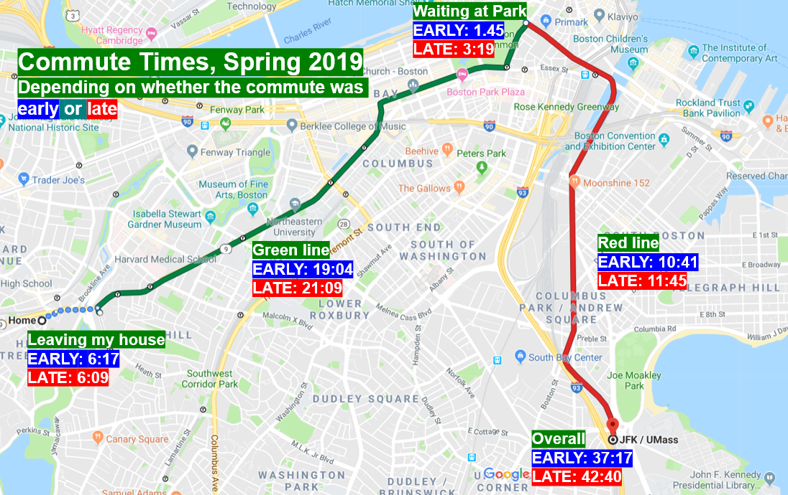

```{r, include=FALSE, echo=FALSE}
library(tidyverse)
commute <-read_csv("commute3.csv")
```

# Research Subject
Ever since coming to campus in Fall 2017, I have become obsessed with timing my commute and seeing how long it takes to go from my house in Brookline Village to UMass Boston. This data may have a limited scope of importance, because _my_ own commute has little effect on others' lives. However, this does provide an interesting backdrop to analyze MBTA trends.

This is a more in-depth followup to last year's post on my statistics blog which can be found [here](http://graphmyundergrad.rbind.io/2019/06/27/tracking-my-nightmarish-commute/). In that analysis, I tracked my commute and found that (no surprise!) commuting at rush hour (the late commute) took about five minutes longer than not commuting at rush hour (the early commute).

```{r, out.width="100%"}

```Nte))
```
Assumptions in this data set include the fact that each day is independent of the other, although this may not be the case. If a delay is significant, its effects may be felt on other days, such as when the red line derailed in June 2019, a mishap that had long-lasting effects. This data is also limited by a lack of long-term trends such as seasonality (many riders report the MBTA being much slower in the winter). Ideally, this sort of data would be collected across the years. The dataset is also limited by the fact that there is a lack in uniformity of the times at which commutes happened. Originally, I had planned to analyze the length of commute as a function of the time it was completed: i.e. whether rush hour had a significant effect on the length. However, due to changing schedules (and the COVID-19 pandemic) there was very little predictability in the times during which I left the house.

# Research Questions

1) What is the average length of each section of the commute? This would involve calculating the sample mean and variance for each segment. I would also like to know whether these are normal or not, and present histograms and the results of Shapiro-Wilk tests for each segment.
2) If not normal, what probability distributions can I use to model each segment of my commute? Using the MLE and MoM, I hope to find probability distributions for each segment of the commute. I doubt they are all normally distributed, however; they might likely all be very right-skewed because although there is theoretically a minimum time needed to commute to school, due to delays, the commute could be hours long. Therefore, these longer commute times will pull out the durations, making the distributions abnormal. I would like to find the parameters for the probability distributions.
3) Is the difference between the length of the commute depending on the directionality (i.e., school to home versus home to school)? During my exploratory data analysis, I noticed that box plots created of distances had very different spreads. I would hope to test this with an F-test for variances between two populations.
4) What segments of the commute have the largest contribution to the overall length? This would deal with the method of partial correlation to see which parts of the commute have the largest proportional increase to the overall length of the journey I have.
5) How long can I expect my commute to be? Using the data, I would like to create confidence intervals for each segment.

# Structure of Dataset
The structure of the data set is shown below. An Excel file is also attached.

```{r}
head(commute)
str(commute)
```